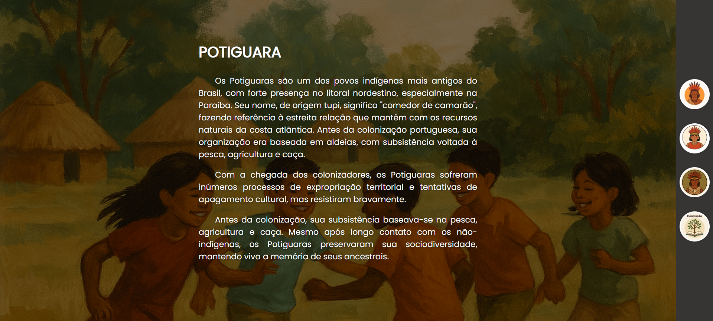

# 🌿 Tribo Potiguara – Projeto Educacional

Este projeto foi desenvolvido como parte de uma apresentação no evento escolar da **ECIT Maria do Carmo de Miranda**, com o objetivo de **valorizar a cultura indígena brasileira**, especificamente a **Tribo Potiguara**, por meio de uma página web informativa e visualmente atrativa.

---

## 👨‍🏫 Sobre o Projeto

Criado por **Hewerson Felipe**, professor da base técnica da instituição, este projeto apresenta de forma acessível informações relevantes sobre a Tribo Potiguara, suas origens, costumes, tradições e importância histórica para a cultura nordestina e brasileira.

O projeto foi exibido durante um evento cultural promovido pela escola, como uma iniciativa de valorização da diversidade e do uso pedagógico da tecnologia em sala de aula.

---

## 🛠 Tecnologias Utilizadas

- **HTML5** – estrutura da página
- **CSS3** – estilização visual e organização dos elementos

---

## 📸 Captura de Tela



---

## 💡 Objetivos Educacionais

- Estimular o uso de ferramentas digitais em projetos escolares
- Apresentar a cultura indígena de forma interativa e acessível
- Promover a interdisciplinaridade entre História, Tecnologia e Cultura

---

## 🔧 Como Executar o Projeto

1. Faça o download ou clone este repositório:
   ```bash
   git clone https://github.com/seu-usuario/nome-do-repositorio.git

---

📄 Licença

Este projeto tem fins educacionais e culturais, sem finalidade comercial.

---

✉️ Contato

Hewerson Felipe Silva Santos

📧 hewersoncg@gmail.com

👨‍🏫 Professor da Base Técnica – ECIT Maria do Carmo de Miranda